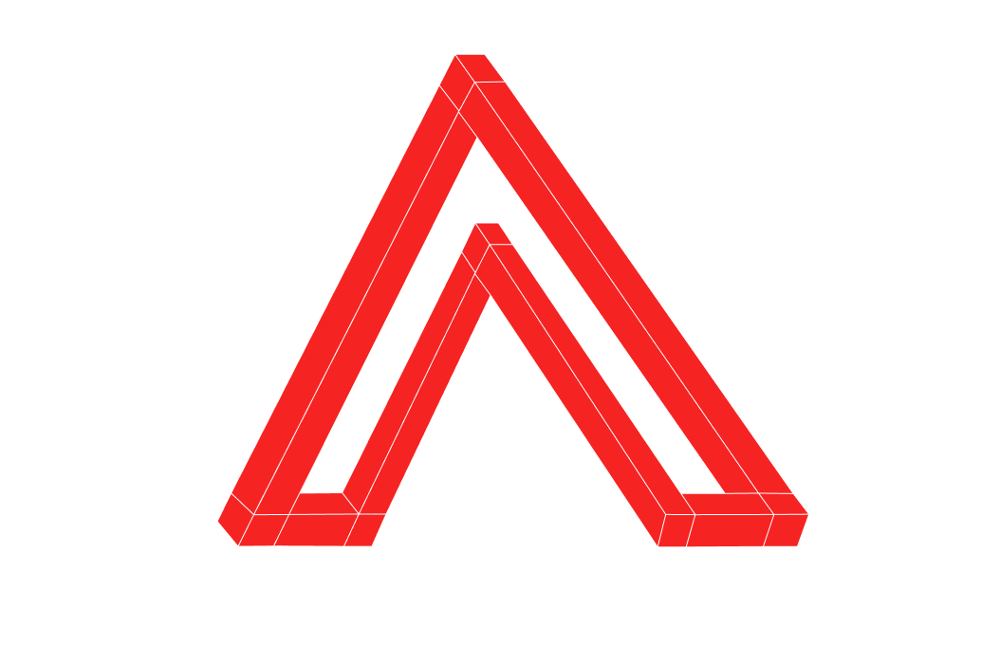
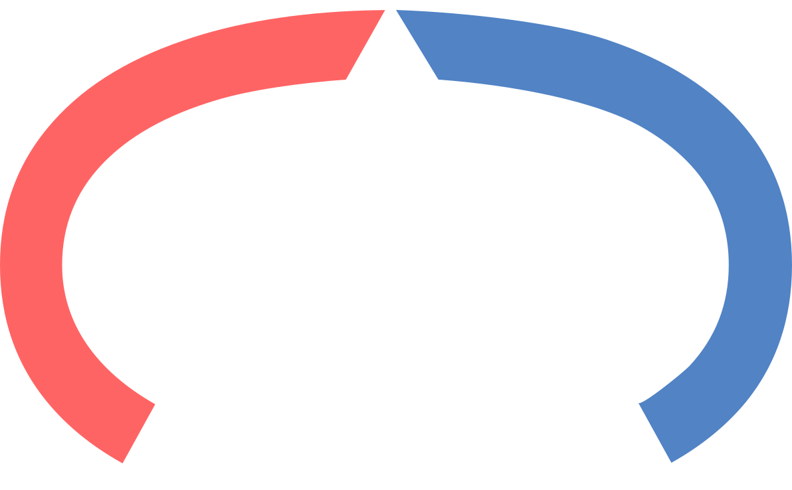

 
#  Actively Raising U$D 1 Million Pre Seed
###  </img> ANNA—> Artificial Intelligence Native Operating Engine.
### 🧠 SOLO—> Head Band. At first, we’ll only be building a prototype for testing which shall later evolve into a consumer device.
##### ♥️ BUILD WITH LOVE. 
### :bulb: ANNA + SOLO will be the Next Generation of AI Native Personal/ Wearable Computer.

📣 FOR IMMEDIATE WORLDWIDE RELEASE 🇺🇸 🗽 ✈️

## 🛸 [Eventual Pivot](https://pitch.com/embed/c73ccbca-4274-47f7-8999-768e887db86a)
##### ⚡ We are ready to start immediately in 2025.
###### ✉️ Contact at--> hello@path-integral.com or on any of the social media.
##### :video_game: A video game version of 🍦THE GRAND LOOP will be developed as a side project.
🚀 [Accelarate by start reading this FAQ](https://github.com/Rulial/pathintegral/blob/d1a80bdcefc3ceeedc676c7f9f41bb025e54bea6/ANNA%20%2B%20SOLO%20FAQ.md)  
🌩️ This is not a crowd funding campaign.  
☀️ This github project is only a landing page for this organisation.  
🔗 The actual project won't be shared here, though we shall be open sourcing the governing systems built on AI Native.

