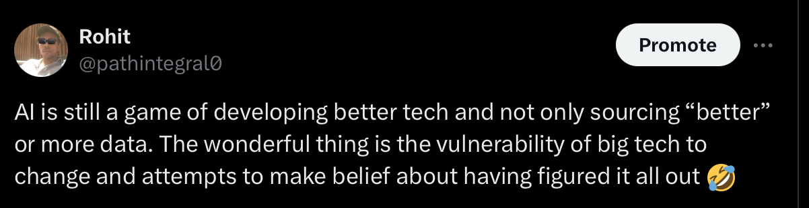

# Actively Raising U$D 1 Million Pre Seed
### BUILD WITH LOVE.
## ANNA—> Artificial Intelligence Native Game Engine.
### SOLO—> Head Band. At first, we’ll only be building a prototype for testing which might later evolve into a consumer device.
ANNA + SOLO will be the Next Generation of AI Native Personal/ Wearable Computer.
A video game 🎮 version of 🍦THE GRAND LOOP, a book I am writing.
It’ll be used for experimentation, and initial revenue generation.
Numbers + terms to be discussed and agreed—> hello@path-integral.com

This is not a crowd funding campaign.

> [Eventual Pivot](https://pitch.com/embed/c73ccbca-4274-47f7-8999-768e887db86a)  

> [Accelarate by start reading this FAQ](https://github.com/Rulial/pathintegral/blob/d1a80bdcefc3ceeedc676c7f9f41bb025e54bea6/ANNA%20%2B%20SOLO%20FAQ.md)

> This github project is only a landing page for this organisation.  
> The actual project won't be posted here, though we shall be open sourcing the governing systems build on AI Native.
